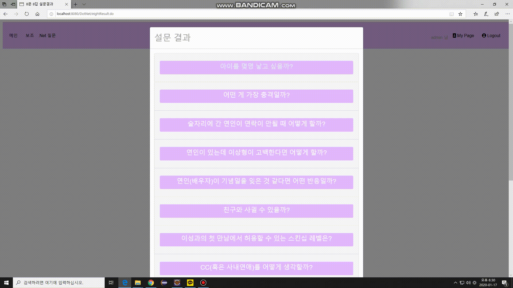

# DotNet Project
 트렌드 조사 웹사이트를 만들고 사이트에서 발생하는 로그를 분석, 이를 다시 웹사이트에 적용하여 사용자 환경을 개선하는 것을 목표로 한 팀프로젝트입니다.

# 1. 웹사이트 만들기
## 1-1 사이트 기획
 소상공인들의 의뢰를 받아 트렌드, 소비 동향, 라이프 스타일 등을 유저들에게 조사하여 의뢰인이 데이터를 활용할 수 있도록 돕는 사이트를 만들고자 했습니다. 또한 소비자들이 스스로 간단한 설문을 만들고 참여함으로써 자체적인 커뮤니티를 형성할 수 있도록 하였습니다.

기능명세, 시퀀스 다이어그램, 클래스 다이어그램 등 기획 세부사항  
-> Visit https://1drv.ms/p/s!AoBxAa-X3p2tgz1aXuU9pVV1amZ6I

UI 기획 -> https://1drv.ms/p/s!AoBxAa-X3p2tfaFrofQVtBp0z-A

## 1-2 담당업무
 1. 개발환경 셋팅 및 배포 - eclipse 무설치 버전 기본 세팅, Spring MVC + MyBatis 환경 세팅 및 배포
 2. 개발부분(FrontEnd, BackEnd) - 설문 만들기, 설문 진행, 결과 및 공유 기능(카카오톡), 게시판 관리, 피드 설문 관련 페이지 및 sql 작성
 3. 유지보수 - 소스 코드 통합 및 버그,오류 수정, 호환성검사 등
 
## 1-3 사용기술  
  

## 1-4 시연화면  
### 설문만들기
  
-로그인 후 설문 만들기 가능  
-양자택일, 5지선다, 8문8답 세가지 양식의 설문(양자택일, 5지선다는 최대 5문항, 8문8답은 8문항)  
-썸네일 추가 가능(drag&drop 방식)  

### 설문참여  
  
-비회원, 회원 모두 설문참여가능  
-선택 수정 가능  
-설문 완료 후 선택사항 확인 및 카카오톡 공유가능  
-부트스트랩 활용 스로틀 기능 이용

### 카카오톡 공유하기  
  
-카카오톡으로 친구에게 공유 가능(카카오 api사용)  
-공유받은 상대의 선택과 공유한 사람의 선택을 비교하여 맞춘개수 확인 혹은 공유한 사람의 선택을 확인 가능  

### 마이페이지 나의 피드설문  
  
-피드페이지에서 회원이 선택한 유형 나타냄  
-자바 스크립트 오픈 소스 활용 효과 추가(카드 뒤집기)  
-친구목록 추가시 친구의 피드페이지로 이동 가능  

### 게시판 관리 페이지  
  
-설문 카테고리 추가 및 제거 가능  
-설문 수에 따른 페이징 및 ajax처리  
-설문 삭제 가능

### 데이터 관리 페이지  
  
-각 설문별 통계 확인 가능(성별 및 연령별 참여정보, 각 항목별 선택 수)  
-캔버스JS 활용 시각 효과 추가  

## 1-5 느낀점 및 어려웠던 점  
### 1. 형상관리의 중요성  
프로젝트 팀장을 맡으면서 개인 작업 외에도 팀원들의 작업 내용을 확인하고 통합하는 일을 맡았다. 처음에는 괜찮았지만 시간이 지나며 프로젝트 규모가 커질질수록 어트 부분이 바뀌었고 어떤 것이 최근에 작업한 것인지 구분하기 힘들었다. 머지 작업의 시간이 늘어남에 따라 개인 작업을 할 시간이 부족해졌고 안되겠다 싶어서 1차 작업이 끝난 후 소스트리와 깃허브를 공부하여 팀원들에게 알려주고 사용하기 시작했다. 처음에는 헷갈렸지만 시간이 지날수록 확실히 효과를 볼 수 있었다.  

### 2. 코드와 파일의 중복 및 흐름파악  
경험의 부재에서 대략적인 생각만으로 설계하다보니 후반으로 갈수록 코드와 파일의 중복이 많아졌다. 프로젝트 도중에 최대한 정리를 해보려 했지만 이미 프로젝트 중반이어서 어려움이 있었다. 또한 개인의 코드 스타일이 모두 다르다보니 다른 사람의 코드를 이해하여 협업하는 것이 어려운 점이 있었다. 후반에는 최대한 주석을 달자고 팀원끼리 상의했지만 이마저도 프로젝트 마감기한에 쫒겨 완벽히 이루어지지 않았다. 이를 통해 평소에 주석을 다는 습관과 설계의 중요성을 깨달을 수 있었다.
